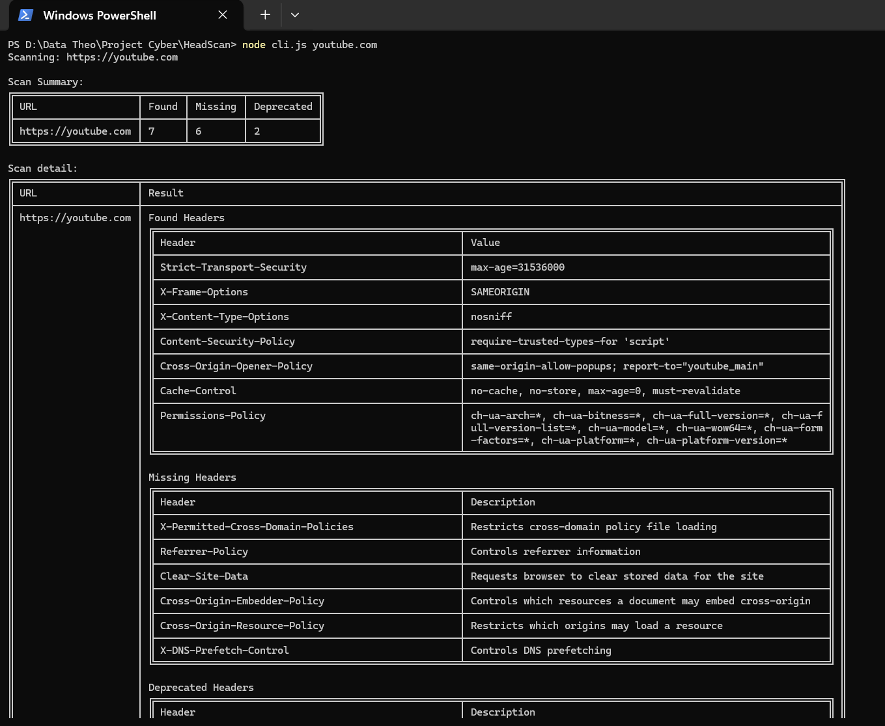

# HeadScan

HeadScan is a website security header scanner. It checks for HTTP response security headers used by a website according to the [OWASP Secure Headers Project (OSHP)](https://owasp.org/www-project-secure-headers/)'s list of [recommended and deprecated security headers](https://github.com/OWASP/www-project-secure-headers/blob/master/tab_headers.md).

<!-- References:
- https://github.com/OWASP/www-project-secure-headers
- https://github.com/OWASP/www-project-secure-headers/blob/master/tab_headers.md
- https://github.com/OWASP/www-project-secure-headers/blob/master/tab_bestpractices.md -->